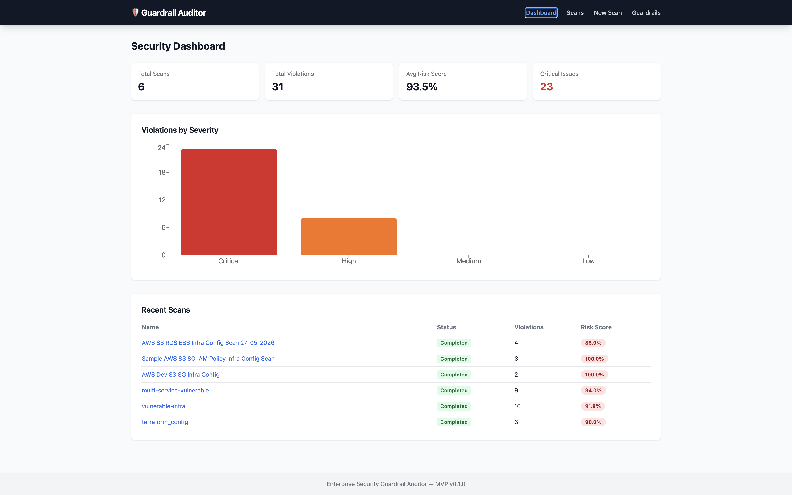
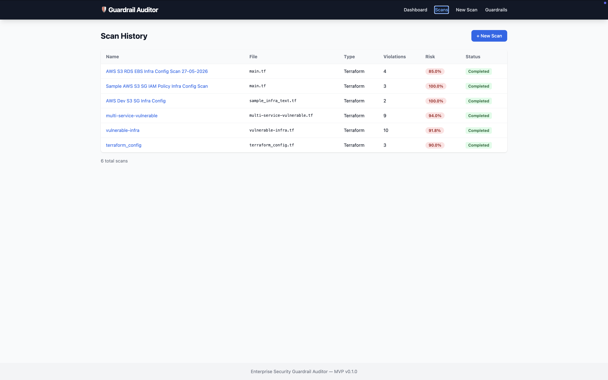
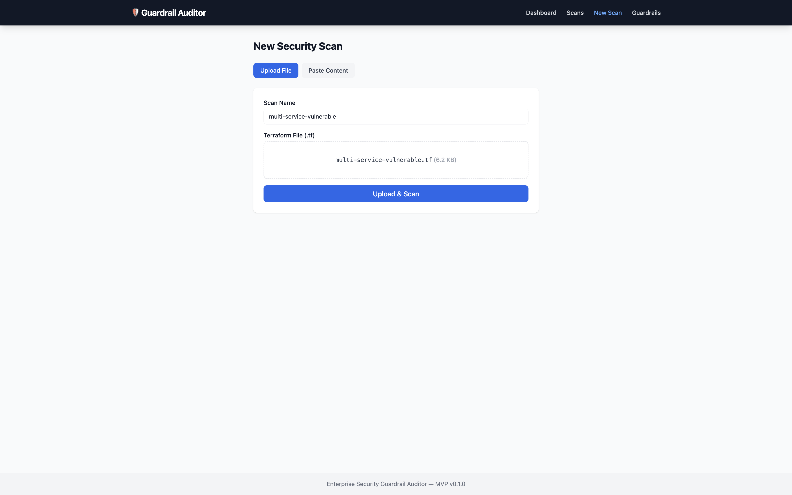
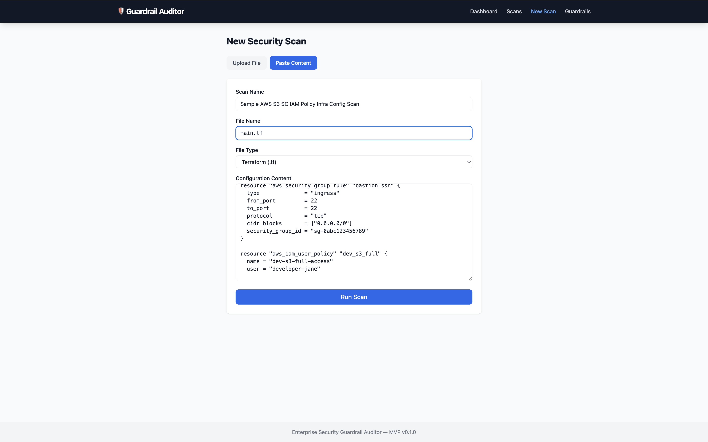
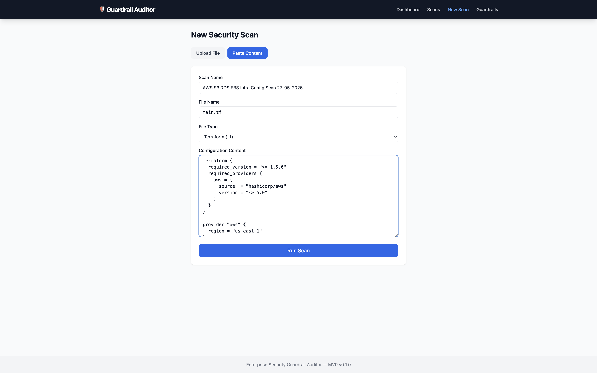
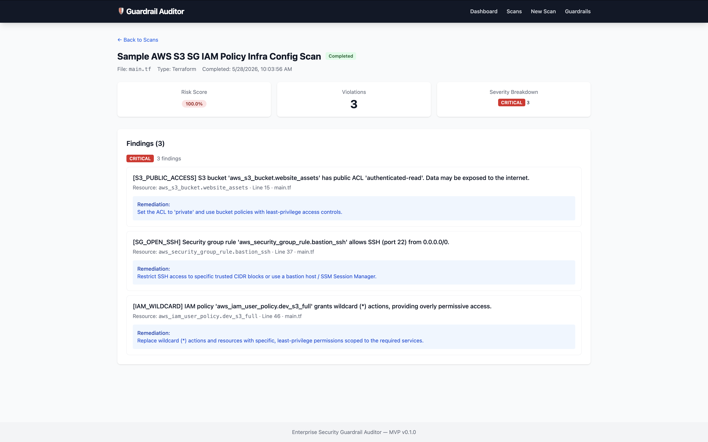
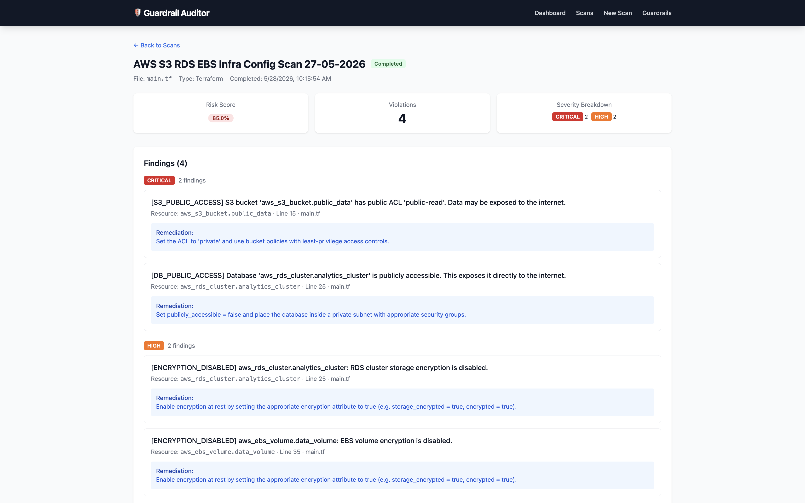
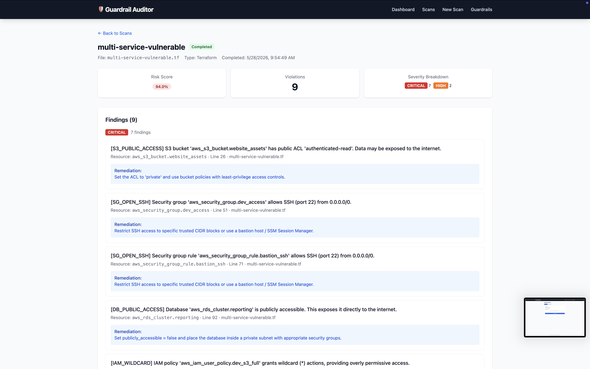

# Enterprise Security Guardrail Auditor — Presentation

---

## Slide 1: Problem Statement

**Infrastructure misconfigurations are the #1 cause of cloud security breaches.**

- Public S3 buckets exposing sensitive data
- Open SSH ports inviting brute-force attacks
- Unencrypted databases violating compliance requirements
- Overly permissive IAM policies granting god-mode access

**Teams need automated, continuous auditing of infrastructure-as-code before deployment.**

---

## Slide 2: Solution

**Enterprise Security Guardrail Auditor** — an API-first scanner that:

1. **Parses** Terraform configuration files
2. **Evaluates** against 15 security rules
3. **Scores** risk on a weighted 0–100 scale
4. **Visualizes** findings in a real-time dashboard

Upload a `.tf` file → Get instant security findings with remediation guidance.

---

## Slide 3: Architecture

```
     Frontend (React 19)           Backend (FastAPI)
    ┌──────────────────┐         ┌─────────────────────┐
    │ Dashboard        │  HTTP   │ Thin Controllers     │
    │ Scan Management  │────────▶│ Scanner Service      │
    │ Risk Viz         │         │ Parser → Rules →     │
    │ Guardrail Config │         │ Scoring → DB         │
    └──────────────────┘         └─────────────────────┘
                                           │
                                    SQLite Database
```

- **API-first**: Frontend is a pure REST consumer
- **Pluggable rules**: Add new security checks via `BaseRule` subclasses
- **Async throughout**: FastAPI + SQLAlchemy async + aiosqlite

---

## Slide 4: Scanner Engine Design

**Four-stage pipeline:**

| Stage | Component | Output |
|-------|-----------|--------|
| 1. Parse | `TerraformParser` | `list[ParsedResource]` |
| 2. Evaluate | `RuleRegistry` → `BaseRule.evaluate()` | `list[Finding]` |
| 3. Score | `calculate_risk_score()` | `float (0–100)` |
| 4. Aggregate | `ScanEngine.scan()` | `ScanResult` |

**Key design choices:**
- Frozen dataclasses for immutable scan results
- Registry pattern for O(1) rule lookup by resource type
- Dual scan paths (engine + legacy regex) with deduplication

---

## Slide 5: Security Rules

| Rule | Severity | What It Catches |
|------|----------|-----------------|
| S3 Public Access | Critical | Public ACL on S3 buckets |
| Open SSH | Critical | Port 22 open to the internet |
| Public Database | Critical | RDS with `publicly_accessible = true` |
| Wildcard IAM | Critical | `"Action": "*"` in policies |
| Disabled Encryption | High | `storage_encrypted = false` |

**Plus 10 regex-based seed guardrails** covering VPC, CloudWatch, EBS, backups, and egress rules.

---

## Slide 6: Risk Scoring

**Weighted severity model:**

| Severity | Weight | Rationale |
|----------|--------|-----------|
| Critical | 10.0 | Immediate exploitation risk |
| High | 7.0 | Significant security gap |
| Medium | 4.0 | Best practice violation |
| Low | 1.0 | Minor improvement |
| Info | 0.5 | Advisory only |

**Formula:** `score = (weighted_sum / max_possible) × 100`

A score of **100** = all critical. A score of **0** = clean.

---

## Slide 7: Frontend Dashboard

**Pages:**

| Page | Features |
|------|----------|
| Dashboard | Stats cards, severity bar chart (Recharts), recent scans |
| Scan List | Paginated table with status/type filters |
| New Scan | Dual-mode: upload `.tf` file or paste content |
| Scan Detail | Findings grouped by severity, risk score badge |
| Guardrails | Security rule management interface |

**Tech:** React 19 + TypeScript + Tailwind CSS + React Query for server state

---

## Slide 8: MVP App Screenshots — Dashboard & Scan History

### Dashboard


### Scan History


---

## Slide 9: MVP App Screenshots — New Scan Forms

### File Upload Mode


### Direct Entry Mode (S3/SG/IAM Config)


### Direct Input Mode (S3/RDS/EBS Config)


---

## Slide 10: MVP App Screenshots — Scan Results

### Results for Direct Entry (S3/SG/IAM)


### Results for Direct Input (S3/RDS/EBS)


### Results for Uploaded Multi-Service Config


---

## Slide 11: Quality & Testing

| Metric | Value |
|--------|-------|
| Backend tests | 97 |
| Backend coverage | 94.65% |
| Frontend tests | 24 |
| Lint violations | 0 (ruff, black, mypy, tsc) |
| Security findings | 26 cataloged, 10 fixed |

**Testing approach:**
- Async integration tests with `httpx.AsyncClient`
- In-memory SQLite for test isolation
- React Testing Library for component behavior testing
- Pre-commit hooks prevent regressions

---

## Slide 12: DevOps & Deployment

- **Docker**: Multi-stage builds, non-root containers, healthchecks
- **docker-compose**: One command to run the full stack
- **GitHub Actions CI**: 5-job pipeline (lint × 2 + test × 2 + docker build)
- **Pre-commit**: ruff, black, mypy, secret detection
- **Makefile**: 12 developer shortcuts

```bash
docker compose up --build -d    # Full stack in 60 seconds
make test                       # Run all tests
make lint                       # Run all linters
```

---

## Slide 13: Tradeoffs & MVP Limitations

| Limitation | Rationale | Future Fix |
|------------|-----------|------------|
| No authentication | MVP scope — focus on scanner logic | JWT/OAuth2 |
| SQLite only | Zero-config, adequate for demo | PostgreSQL option |
| Regex-based parser | No binary deps, pure Python | HCL2 library |
| Sync scanning | Simple flow for single files | Background tasks |
| AWS rules only | Most common cloud provider | Azure/GCP rules |
| No CloudFormation | Terraform first approach | YAML/JSON parser |

---

## Slide 14: Future Roadmap

**Near-term:**
- API key authentication
- CloudFormation YAML/JSON parsing
- Azure and GCP rule packs
- Export results as PDF/CSV

**Long-term:**
- JWT/OAuth2 with RBAC
- Async scan processing
- Multi-file / zip upload
- Scan trend comparison charts
- Webhook notifications for critical findings
- PostgreSQL migration option
- Custom guardrail creation via UI

---

## Slide 15: AI-Assisted Development

**Coding Assistant:** GitHub Copilot with Claude Opus 4.6

**Workflow:**
1. Detailed prompt describing the feature/phase
2. AI generates implementation + tests + docs
3. All code verified by running test suites
4. Every prompt recorded in `prompts.md` audit log

**Results:**
- 9 development turns over ~55 minutes of interaction
- 40+ files generated and refined
- 97 backend tests + 24 frontend tests
- Zero lint violations across 4 linters
- Full DevOps pipeline (Docker, CI, pre-commit)
- Comprehensive documentation suite (13 docs)

**Key insight:** AI-assisted development accelerates scaffold-to-MVP delivery while maintaining high code quality through automated testing and linting guardrails.

---

## Slide 16: Summary

**Enterprise Security Guardrail Auditor** delivers:

- ✅ Automated IaC security scanning with 15 rules
- ✅ Weighted risk scoring (0–100)
- ✅ Visual dashboard with severity charts
- ✅ RESTful API with OpenAPI documentation
- ✅ 94.65% test coverage, zero lint violations
- ✅ Production-ready Docker deployment
- ✅ Extensible rule system for future growth

**Repository:** [github.com/SimeonDee/Enterprise-Security-Guardrail-Auditor](https://github.com/SimeonDee/Enterprise-Security-Guardrail-Auditor)
